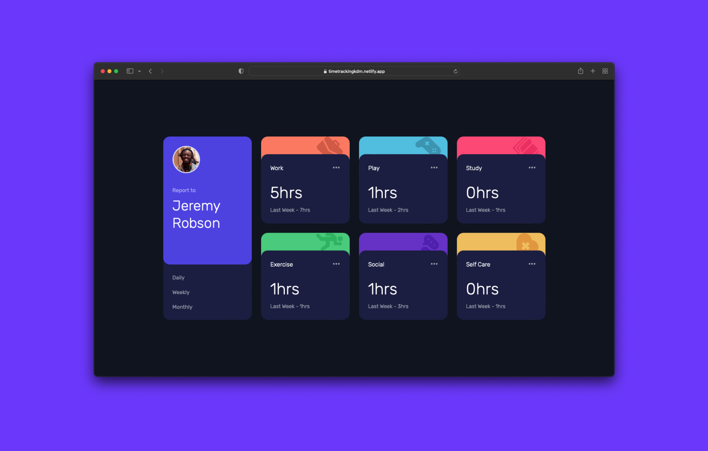

  <h1> ⏱ Time tracking dashboard ⏱</h1>

## The challenge

Users should be able to:

- View the optimal layout for the site depending on their device's screen size
- See hover states for all interactive elements on the page
- Switch between viewing Daily, Weekly, and Monthly stats

## My process
### Built with

  

- React
- React Hooks (useState, useEffect)
- Tailwind CSS
- Semantic HTML5 markup
- Flex and grid Layout

## Links

- Frontend Mentor solution: [Click here](https://www.frontendmentor.io/solutions/time-tracking-dashboard-react-tailwind-css-zcHimGfP5a)
- Live Site URL: [Click here](https://timetrackingkdm.netlify.app/)

## Author

- Website - [Héctor Olivares](https://www.hectorolivares.me/)
- Frontend Mentor - [@hectorolivares](https://www.frontendmentor.io/profile/hectorolivares)
- Twitter - [@hektorolivares](https://twitter.com/hektorolivares)

